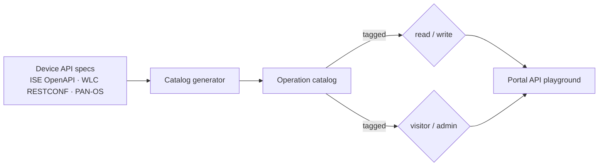

# API automation

Resetting the lab is half the demo. The other half is letting a visitor drive the **live management
APIs** of each device — safely, because a reset undoes anything they change.

## What's covered

| Device | Interface | Examples |
|--------|-----------|----------|
| Cisco ISE | **OpenAPI + ERS** | identity groups, endpoints, network devices, authz policy, internal CA |
| Cisco 9800 WLC | **RESTCONF** | WLANs, policy/site tags, RADIUS server config |
| Palo Alto | **PAN-OS REST / XML** | security policy, objects, certificate import, commit |

The goal is to expose *most of* each device's API surface, not a hand-picked few calls — the catalog
is generated from the devices' own specs rather than written by hand.

## A generated, tagged catalog

Every operation is tagged two ways:

- **read vs write** — so the UI can show what is safe to explore versus what mutates state;
- **visitor vs admin** — visitors get read everywhere plus writes on access-control / identity /
  policy objects (all snapshot-recoverable); admins additionally get system, deployment,
  certificate-bind, licensing, and destructive operations, plus a free-form API console.

Because the catalog is generated from the live specs, it stays current as the devices are upgraded
instead of drifting from a hand-maintained list.

## Certificate lifecycle

Certificates are a first-class demo, not an afterthought, because cert renewal is where
multi-vendor deployments actually hurt. The enclave runs a **real Windows CA (AD CS / NDES)** on the
domain controller, so SCEP enrollment and renewal work end to end — alongside ISE's internal CA.

The `cert_lifecycle.yml` playbook is the renewal path across ISE, the WLC, the Palo Alto, and the
NAC endpoint. A visitor (or the admin console) can trigger a renewal and watch the new certificate
propagate, then roll the whole thing back with a reset.

## Why writes are safe

Every write a visitor can make lands on an object that the **golden-snapshot reset** restores. There
is no persistent state a visitor can corrupt that a one-click reset doesn't undo — which is exactly
why the API playground can be a real, writable surface instead of a read-only tour.
