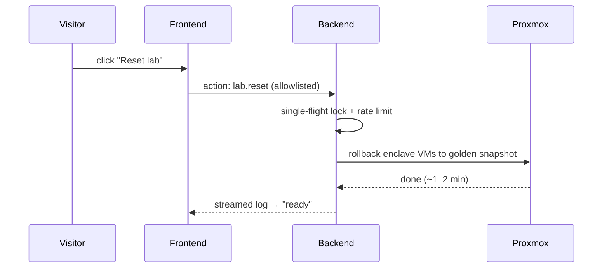

# Architecture

The architecture is built around one requirement: a website visitor must be able to drive a real
multi-vendor security stack — including *writing* config — without ever holding privilege or reaching
the lab network. Everything below follows from that.

## Three tiers, hard privilege separation

| Tier | Where it runs | Holds | A visitor can… |
|------|---------------|-------|----------------|
| **1 · Portal frontend** | DMZ VM, visitor-facing | nothing — no token, key, or secret | reach it directly |
| **2 · Backend / runner** | trusted VM, not visitor-reachable | the scoped Proxmox token, the SOPS age key, the enclave SSH key | only *request* a fixed action menu |
| **3 · Enclave** | isolated VLANs, default-deny upstream | the actual devices | never reach it |

The frontend renders buttons and live logs. When a visitor clicks one, the frontend asks the backend
to run a **named action from an allowlist** — enums only, no free-form command. The backend is the
only tier with privilege and the only tier that can reach the enclave. This is what makes a "write"
playground safe: even a fully compromised frontend can only ask for actions that already exist.

## The enclave topology

The enclave lives on an isolated services VLAN with default-deny upstream, fronted by the Palo Alto
so that firewall policy sits *on top of* ISE authorization.

| Host | Role |
|------|------|
| `ise1` | Cisco ISE 3.4 — the policy / admin node |
| `dc-demo` | Windows Server DC — DNS, NTP, AD, and the CA (AD CS / NDES) |
| `wlc-demo` | Cisco 9800-CL wireless LAN controller |
| `pa-demo` | Palo Alto VM-Series, inline as the gateway for the client VLANs |
| `nad-sw` | virtual Catalyst switch acting as a wired NAD |
| endpoint VLAN | a wired NAC test endpoint |
| client VLAN | wireless clients behind a real access point |

Sub-VLANs are default-deny upstream, with the Palo Alto inline as their gateway. The wired endpoint
and wireless clients exercise 802.1X / MAB end to end, so an authorization change in ISE produces a
visible effect on a real client.

## Reset, not rebuild

The golden snapshot is taken **with VM state**, so it must capture a *healthy* ISE — a snapshot of a
half-initialized ISE would roll back to a broken one. That makes "ISE is healthy" a precondition for
cutting the golden image, not an afterthought.

## Platform VMs and scale-out

Two platform VMs sit outside the enclave: the **portal** (DMZ, public) and the **runner** (trusted,
holds the secrets). The admin role can, on demand, bring up additional ISE nodes to demonstrate a
**distributed deployment** — a separate PSN / MnT / secondary PAN — as a showpiece, on top of the
single-node default loop.

## Public edge

The portal is published through the same hardened edge the rest of the estate uses: an Oracle-hosted
BunkerWeb reverse proxy terminating Let's Encrypt TLS with a WAF, an auth gate in front of the
visitor session, and Cloudflare DNS. The backend and enclave are never exposed to the internet.
