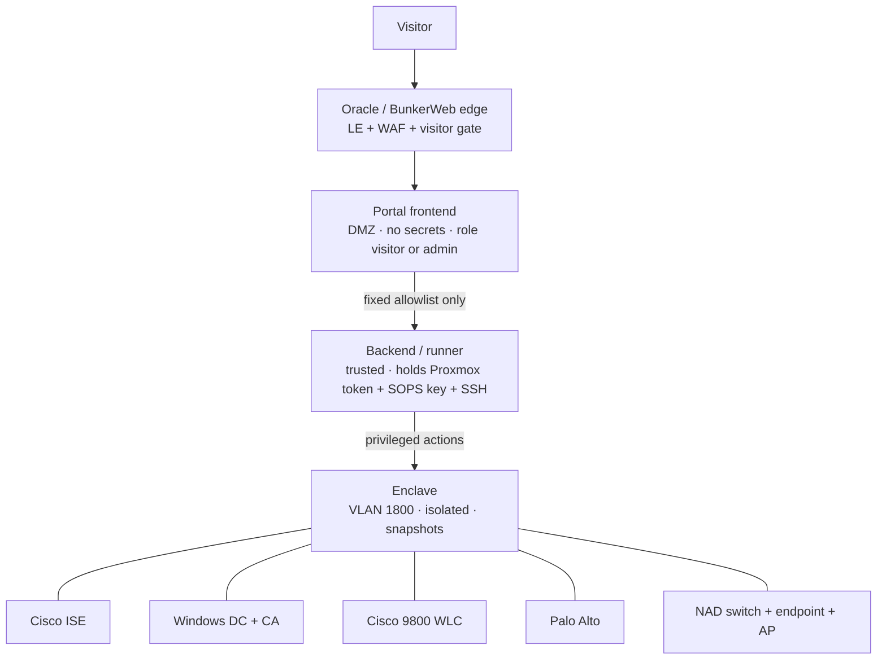

# ise-lab-demo

A standalone, self-service **multi-vendor security demo lab**. A visitor drives it entirely from a
gated website — with no other access to the lab — and can exercise both halves of a real security
deployment:

- **Infrastructure automation** — rebuild or fast-reset Cisco ISE, a Windows Server domain
  controller, a Cisco WLC, and a Palo Alto firewall.
- **API automation** — most of ISE **OpenAPI + ERS**, WLC **RESTCONF**, and **PAN-OS** REST/XML,
  including cross-device **certificate renewal**.

It is **demo-only by design**: tearing the lab down and rebuilding it *is* the demo. Because every
reset wipes the enclave back to a known-good state, a visitor can safely *write* configuration — the
API playground is real, not a read-only tour.

!!! note "Why a golden-snapshot reset instead of a rebuild"
    A from-scratch ISE build is a poor interactive loop — first boot alone is 45–65 minutes. So the
    default visitor action is a **rollback to a golden snapshot (~1–2 minutes)**. Full rebuilds and
    scale-out are still available, but as deliberate admin actions.

## The three-tier spine

The entire design exists to keep an untrusted website visitor away from anything that holds
privilege. There are three tiers, and a visitor only ever reaches the first.



A fully compromised visitor session still cannot run an arbitrary command or read a secret: the
frontend holds no credentials and can only *request* a fixed menu of actions from the backend, and
only the backend reaches the enclave. See [Visitor isolation model](security.md) for the full
boundary.

## Where this came from

This is a separate project from the home-lab `proxmox-automation` repo — its own repo, its own
secrets, and its own VMs. An existing, hand-built ISE enclave is the seed; this project
productionizes it into a self-service platform with guardrails, an allowlisted action catalog, and a
branded portal.

## Repository layout

```
ansible/    the engine — provision / reset VMs + device config
  roles/    proxmox_vm · cisco_ise · (palo_alto, nac_endpoint — to add)
  drivers/  headless console drivers for first-boot automation
backend/    FastAPI + ansible-runner + the allowlisted catalog engine + guardrails
frontend/   the visitor portal (buttons + live logs)
catalog/    generated API operation catalog (ISE / WLC / PA), tagged read/write + visitor/admin
infra/      portal + runner VM provisioning, edge config
secrets/    project SOPS store (encrypted; its own age key — nothing real is committed)
docs/       these docs (MkDocs Material)
```

## Status

Foundations and the automation engine are in place; the backend runner and its guardrails are
built; the portal and the API catalog are the active work. The seed enclave stays untouched while the
platform is built around it. The phased plan lives with the project; this site tracks the design and
how the pieces fit.
