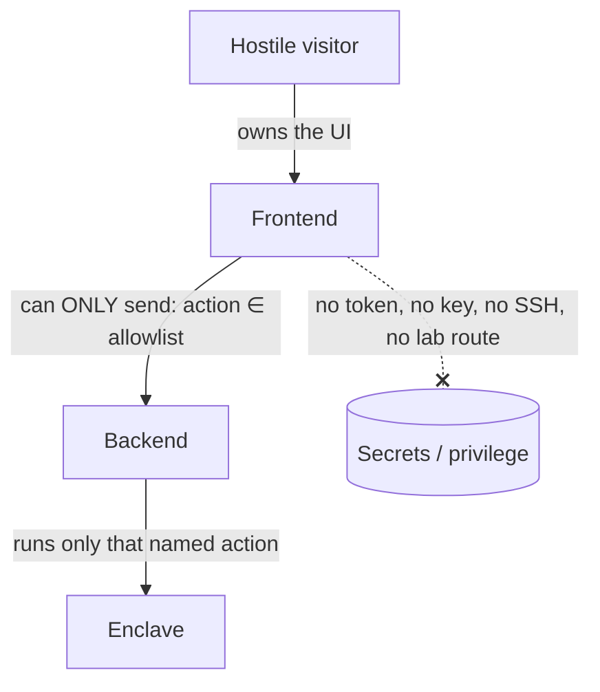

# Visitor isolation model

The single most important property of this project is that an **untrusted website visitor cannot
escape the portal**. Everything else — the resets, the API playground — only exists because this
boundary holds. This page states the boundary explicitly.

!!! info "Status"
    The backend, the frontend, and the public edge are live today — the allowlist, the guardrails, and
    the visitor-session gate all hold. The one piece still planned is the adversarial boundary test
    described at the end of this page.

## The threat

Assume the worst: a visitor is hostile and the **frontend is fully compromised**. The question is not
"can we keep them out of the UI" — they own the UI. The question is what privilege that buys them.
The answer must be: none.

## Why it holds

Three properties combine:

1. **The frontend holds nothing.** No Proxmox token, no SOPS key, no SSH key, no route to the lab
   network. Compromising it yields no credential.
2. **The interface is an allowlist, not a shell.** The frontend can only ask the backend to run a
   **named action from a fixed catalog** — enums, no free-form command, no arbitrary playbook, no
   parameters that become shell. There is nothing to inject because there is no interpreter on the
   other end.
3. **Only the backend has privilege**, and the backend is **not reachable** by the visitor at all —
   it sits on a trusted tier that the frontend talks to, but the visitor does not.

So the worst a compromised visitor session can do is invoke actions that already exist — all of which
are snapshot-recoverable — at a rate the backend's limits allow.

## Role boundary

| Capability | Visitor | Admin |
|------------|:-------:|:-----:|
| Read any device state | ✓ | ✓ |
| Write access-control / identity / policy objects | ✓ | ✓ |
| System / deployment / licensing changes | — | ✓ |
| Certificate bind / destructive operations | — | ✓ |
| Full rebuild + scale-out | — | ✓ |
| Free-form API console | — | ✓ |

Visitor writes are deliberately scoped to objects the **golden-snapshot reset** restores. Admin
actions — the ones that aren't cleanly recoverable, or that touch the platform itself — sit behind
authentication.

## Defense in depth around the boundary

The allowlist is the core control; these reinforce it:

- **Backend guardrails** — single-flight lock (one destructive op at a time), per-session rate
  limit, action timeouts, and secret-scrubbing on streamed output.
- **Network isolation** — the enclave is on isolated VLANs, default-deny upstream, with the Palo Alto
  inline; the backend reaches it, the internet does not.
- **Scoped Proxmox token** — even the backend's own credential is least-privilege: it can only touch
  the enclave VM pool, the lab storage, and the SDN zones (see
  [The automation engine](engine.md#least-privilege-proxmox-access)).
- **Hardened public edge** — WAF + TLS + a visitor-session gate in front of the portal.

A planned hardening phase includes an **adversarial test of this boundary** — actively trying to
reach privilege from a visitor session — before the lab is opened up.
